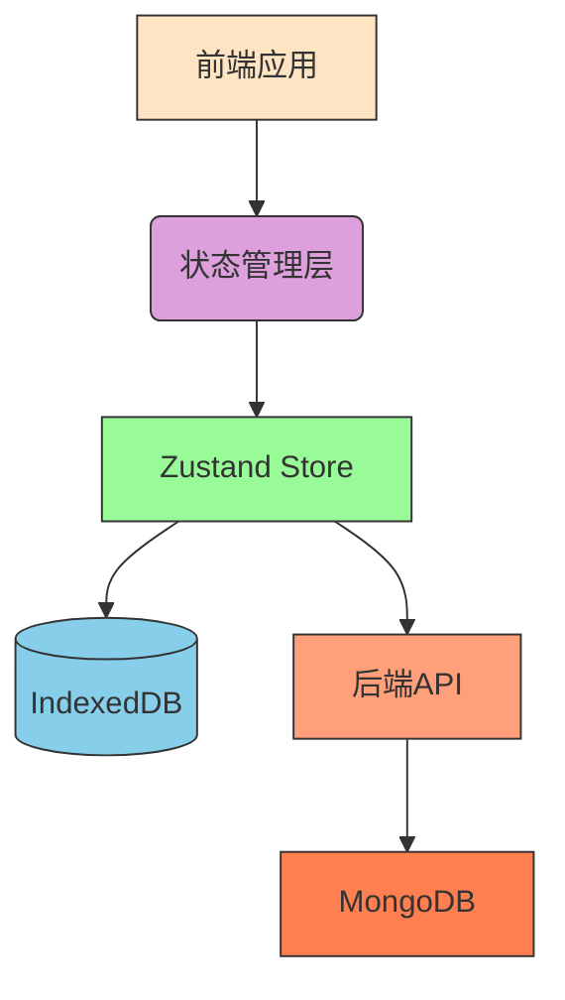
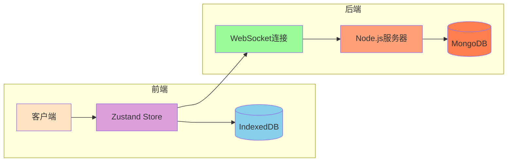
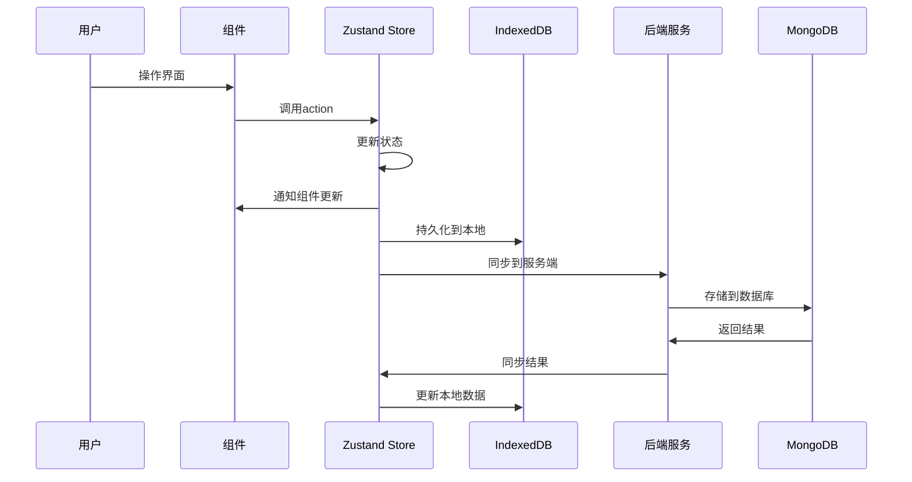
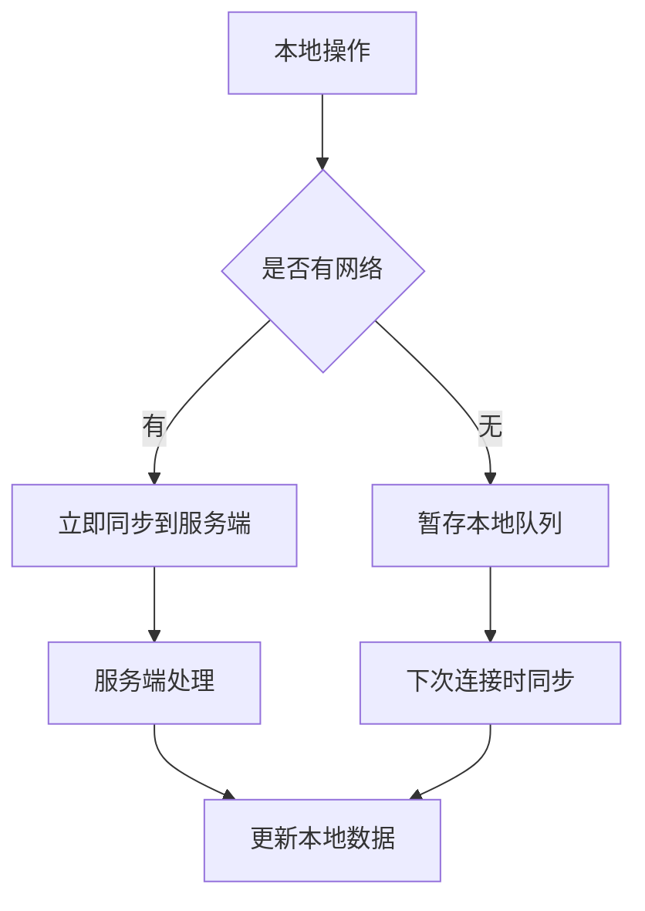
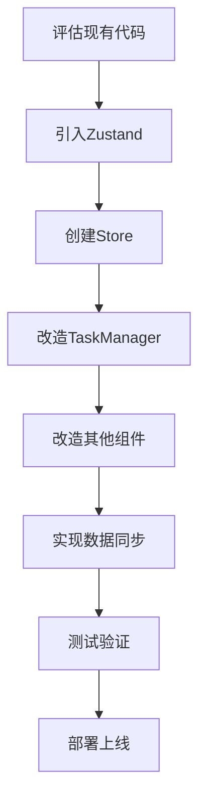

# React状态管理优化设计文档

## 1. 概述

### 1.1 问题背景
当前项目使用React的useState和useEffect进行状态管理，存在以下问题：
- 页面刷新后任务数据丢失
- 复杂的状态逻辑难以维护
- 组件间状态共享困难
- 性能优化挑战较大

### 1.2 解决方案目标
将项目从React原生状态管理迁移到更强大的状态管理方案，实现：
- 数据持久化存储（避免刷新丢失）
- 更好的状态管理架构
- 提升应用性能和可维护性
- 支持复杂业务逻辑处理

## 2. 技术栈选型

### 2.1 现有技术栈分析
当前项目使用的技术栈包括：
- React 19.2.0
- Ant Design 5.27.4
- Moment.js 2.30.1
- react-dnd 16.0.1（拖拽功能）
- react-beautiful-dnd 13.1.1
- recharts 3.2.1（图表）

### 2.2 新技术栈选型

| 方面 | 原技术栈 | 新技术栈 | 选型理由 |
|------|----------|----------|----------|
| 状态管理 | React useState/useEffect | Zustand | 轻量级、易集成、性能好 |
| 数据持久化 | LocalStorage | IndexedDB + 同步机制 | 更适合结构化数据存储 |
| 后端服务 | 无 | Node.js + Express | 提供数据同步和用户管理 |
| 数据库 | 无 | MongoDB | 文档型数据库，易于扩展 |

### 2.3 架构演进图



## 3. 架构设计

### 3.1 整体架构



### 3.2 状态管理架构

#### 3.2.1 Zustand Store设计

```javascript
// store/todoStore.js
import { create } from 'zustand'
import { persist, subscribeWithSelector } from 'zustand/middleware'
import { createStore as createVanilla } from 'zustand/vanilla'

const useTodoStore = create(
  subscribeWithSelector(
    persist(
      (set, get) => ({
        // 状态定义
        tasks: [],
        tags: [],
        user: null,
        settings: {},
        
        // 动作定义
        addTask: (task) => set((state) => ({ tasks: [...state.tasks, task] })),
        updateTask: (id, updates) => set((state) => ({
          tasks: state.tasks.map(task => 
            task.id === id ? { ...task, ...updates } : task
          )
        })),
        deleteTask: (id) => set((state) => ({
          tasks: state.tasks.filter(task => task.id !== id)
        })),
        
        // 异步动作
        fetchTasks: async () => {
          // 从服务端获取任务
        },
        syncTasks: async () => {
          // 同步本地和远程任务
        }
      }),
      {
        name: 'todo-storage', // 存储键名
        partialize: (state) => ({ 
          tasks: state.tasks, 
          tags: state.tags,
          settings: state.settings
        }), // 持久化部分状态
      }
    )
  )
)
```

#### 3.2.2 数据流设计



## 4. 核心模块设计

### 4.1 任务管理模块

#### 4.1.1 状态结构设计

| 属性 | 类型 | 描述 |
|------|------|------|
| id | string/number | 任务唯一标识 |
| title | string | 任务标题 |
| description | string | 任务描述 |
| completed | boolean | 完成状态 |
| dueDate | string | 截止日期 |
| priority | string | 优先级(high/medium/low) |
| remindTime | string | 提醒时间 |
| tagIds | array | 关联标签ID数组 |
| subTasks | array | 子任务数组 |
| dependencies | array | 依赖任务ID数组 |
| projectId | string | 项目ID |
| comments | array | 评论数组 |

#### 4.1.2 状态管理接口

| 接口名称 | 参数 | 返回值 | 描述 |
|---------|------|--------|------|
| addTask | Task object | void | 添加任务 |
| updateTask | id, updates | void | 更新任务 |
| deleteTask | id | void | 删除任务 |
| toggleComplete | id | void | 切换完成状态 |
| moveTask | fromIndex, toIndex | void | 移动任务位置 |
| batchUpdateTasks | ids, updates | void | 批量更新任务 |
| loadTasks | - | Promise<Task[]> | 加载任务列表 |
| syncTasks | - | Promise<void> | 同步任务数据 |

### 4.2 标签管理模块

#### 4.2.1 状态结构设计

| 属性 | 类型 | 描述 |
|------|------|------|
| id | string/number | 标签唯一标识 |
| name | string | 标签名称 |
| color | string | 标签颜色 |

#### 4.2.2 状态管理接口

| 接口名称 | 参数 | 返回值 | 描述 |
|---------|------|--------|------|
| addTag | Tag object | void | 添加标签 |
| updateTag | id, updates | void | 更新标签 |
| deleteTag | id | void | 删除标签 |
| loadTags | - | Promise<Tag[]> | 加载标签列表 |

### 4.3 用户管理模块

#### 4.3.1 状态结构设计

| 属性 | 类型 | 描述 |
|------|------|------|
| id | string | 用户ID |
| username | string | 用户名 |
| email | string | 邮箱 |
| avatar | string | 头像URL |
| preferences | object | 用户偏好设置 |

#### 4.3.2 状态管理接口

| 接口名称 | 参数 | 返回值 | 描述 |
|---------|------|--------|------|
| login | credentials | Promise<User> | 用户登录 |
| logout | - | void | 用户登出 |
| register | userInfo | Promise<User> | 用户注册 |
| updateUser | updates | void | 更新用户信息 |

## 5. 数据持久化策略

### 5.1 本地存储方案

#### 5.1.1 IndexedDB设计

```javascript
// db/indexedDB.js
const DB_NAME = 'TodoListProDB';
const DB_VERSION = 1;
const STORES = {
  TASKS: 'tasks',
  TAGS: 'tags',
  SETTINGS: 'settings'
};

// 数据库初始化
const initDB = () => {
  return new Promise((resolve, reject) => {
    const request = indexedDB.open(DB_NAME, DB_VERSION);
    
    request.onerror = () => reject(request.error);
    request.onsuccess = () => resolve(request.result);
    
    request.onupgradeneeded = (event) => {
      const db = event.target.result;
      
      // 创建任务存储
      if (!db.objectStoreNames.contains(STORES.TASKS)) {
        const taskStore = db.createObjectStore(STORES.TASKS, { keyPath: 'id' });
        taskStore.createIndex('completed', 'completed', { unique: false });
        taskStore.createIndex('dueDate', 'dueDate', { unique: false });
      }
      
      // 创建标签存储
      if (!db.objectStoreNames.contains(STORES.TAGS)) {
        const tagStore = db.createObjectStore(STORES.TAGS, { keyPath: 'id' });
      }
      
      // 创建设置存储
      if (!db.objectStoreNames.contains(STORES.SETTINGS)) {
        const settingStore = db.createObjectStore(STORES.SETTINGS, { keyPath: 'key' });
      }
    };
  });
};
```

#### 5.1.2 同步机制设计



### 5.2 服务端存储方案

#### 5.2.1 MongoDB Schema设计

```javascript
// models/Task.js
const taskSchema = new mongoose.Schema({
  id: { type: String, required: true, unique: true },
  title: { type: String, required: true },
  description: String,
  completed: { type: Boolean, default: false },
  dueDate: Date,
  priority: { type: String, enum: ['high', 'medium', 'low'], default: 'medium' },
  remindTime: String,
  tagIds: [String],
  subTasks: [{
    id: String,
    title: String,
    completed: Boolean
  }],
  dependencies: [String],
  projectId: String,
  comments: [{
    id: String,
    content: String,
    createdAt: Date,
    userId: String
  }],
  userId: { type: String, required: true },
  createdAt: { type: Date, default: Date.now },
  updatedAt: { type: Date, default: Date.now }
});
```

## 6. 组件改造方案

### 6.1 TaskManager组件改造

#### 6.1.1 状态获取方式变更

```jsx
// 改造前 - 使用useState和useEffect
const [tasks, setTasks] = useState([]);

// 改造后 - 使用Zustand Store
const tasks = useTodoStore(state => state.tasks);
const addTask = useTodoStore(state => state.addTask);
const updateTask = useTodoStore(state => state.updateTask);
const deleteTask = useTodoStore(state => state.deleteTask);
```

#### 6.1.2 数据操作方式变更

```jsx
// 改造前
const addTask = () => {
  if (newTask.title.trim() !== '') {
    const task = {
      id: Date.now(),
      // ...其他属性
    };
    setTasks([...tasks, task]);
  }
};

// 改造后
const addTask = () => {
  if (newTask.title.trim() !== '') {
    const task = {
      id: Date.now(),
      // ...其他属性
    };
    useTodoStore.getState().addTask(task);
  }
};
```

### 6.2 其他组件改造要点

1. **TagManager组件**：从直接操作LocalStorage改为通过Store操作
2. **Statistics组件**：从props接收数据改为从Store订阅数据
3. **Login组件**：增加与服务端交互的逻辑
4. **Settings组件**：支持本地和服务端设置同步

## 7. 迁移策略

### 7.1 迁移步骤



### 7.2 兼容性考虑

1. **渐进式迁移**：保留LocalStorage读取逻辑，逐步迁移到新架构
2. **数据转换**：提供数据迁移脚本，将现有LocalStorage数据导入IndexedDB
3. **回滚机制**：提供降级方案，在新架构出现问题时可快速回退

### 7.3 风险控制

| 风险点 | 应对措施 |
|--------|----------|
| 数据丢失 | 实现完整的数据备份和恢复机制 |
| 性能下降 | 进行充分的性能测试和优化 |
| 兼容性问题 | 保持向后兼容，逐步替换旧代码 |
| 网络异常 | 实现完善的错误处理和重试机制 |

## 8. 性能优化

### 8.1 状态更新优化

1. 使用`useShallow`进行浅比较，避免不必要的重渲染
2. 对大型列表使用虚拟滚动技术
3. 实现组件级别的记忆化优化

### 8.2 数据同步优化

1. 实现增量同步，只同步变更的数据
2. 使用WebSocket实现实时同步
3. 添加同步状态提示，提升用户体验

### 8.3 存储优化

1. 对历史数据进行归档处理
2. 实现数据压缩存储
3. 添加存储空间监控和清理机制

## 9. 测试策略

### 9.1 单元测试

1. Store状态管理测试
2. 组件渲染测试
3. 数据操作测试

### 9.2 集成测试

1. 本地存储集成测试
2. 服务端同步测试
3. 网络异常处理测试

### 9.3 性能测试

1. 大数据量渲染性能测试
2. 同步性能测试
3. 内存占用测试