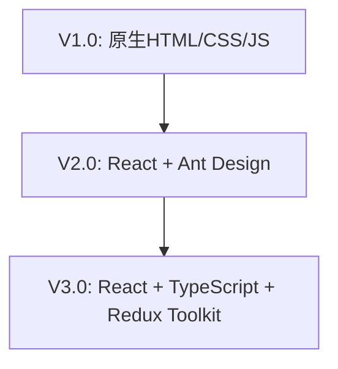
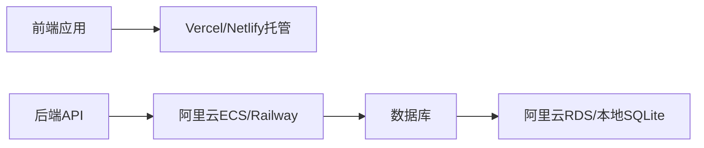

# To-Do List Pro 项目需求文档分析

## 1. 概述

### 1.1 项目目标
打造一款轻量化、人性化、高适配性的个人任务管理工具，覆盖从任务创建到复盘的全流程，通过降低操作成本、贴合用户习惯、解决隐性痛点，帮助用户高效管理任务，减少"任务焦虑"，提升时间利用率。

### 1.2 核心价值
- 单人开发可控：技术栈轻量且模块化，支持分阶段迭代（基础版→进阶版→优化版）
- 实用性优先：功能聚焦"真实使用场景"，避免冗余设计，确保用户上手即用
- 人性化体验：从操作、情绪、习惯多维度适配用户，而非让用户适配工具

## 2. 用户画像分析

| 用户类型 | 核心需求 | 痛点 | 产品适配点 |
|---------|---------|------|-----------|
| 职场新人 | 任务分类清晰、避免逾期、快速记录临时工作 | 任务多易混乱，忘记截止时间 | 标签分类、到期提醒、语音录入 |
| 学生 | 区分学习/生活任务、拆分复杂任务（如作业） | 复杂任务难推进，易堆积 | 任务拆分、难度标注、轻量化复盘 |
| 自由职业者 | 跨设备同步任务、自定义操作流程 | 多设备切换麻烦，操作效率低 | 跨端同步、自定义快捷键、模板库 |

## 3. 功能需求架构

### 3.1 基础核心层（V1.0必实现）

#### 3.1.1 任务基础操作
- 支持任务"添加-编辑-删除-标记完成/未完成"全流程
- 添加任务包含标题、描述、截止日期，支持快速填写
- 删除任务时弹出确认提示，避免误操作

#### 3.1.2 任务分类管理
- 支持创建/编辑/删除自定义标签，标签可设置专属颜色
- 任务可关联多个标签，列表页支持按标签筛选

#### 3.1.3 数据存储与基础交互
- 前端用LocalStorage存储数据（基础版）
- 支持任务拖拽调整显示顺序

### 3.2 进阶体验层（V2.0迭代）

#### 3.2.1 任务优先级与提醒
- 优先级设置：任务支持标注"高/中/低"优先级
- 到期提醒：支持自定义提醒时间，触发浏览器通知+页面弹窗提醒

#### 3.2.2 用户登录与跨端同步
- 支持"手机号/邮箱+验证码"注册登录，用JWT实现身份验证
- 后端存储用户数据，实现跨端同步

#### 3.2.3 任务搜索与统计
- 搜索功能：支持关键词实时匹配任务"标题/描述"
- 简易统计：首页显示"今日待办数/已完成数/逾期数"

### 3.3 人性化优化层（V3.0迭代）

#### 3.3.1 降低操作成本
- 任务模板库：预设常用模板，支持自定义编辑
- 智能联想输入：输入任务标题时显示历史同类任务
- 批量操作：支持勾选多个任务，批量执行操作

#### 3.3.2 贴合情绪与习惯
- 任务难度与情绪标注：可选择"难度"和"预期情绪"
- 个性化时间视图：支持"列表视图/日历视图/时间轴视图"切换
- 使用习惯记忆：自动记忆用户常用设置

#### 3.3.3 解决隐性痛点
- 逾期任务智能疏导：提供延期、拆分、归档等选项
- 任务依赖提醒：支持设置依赖任务
- 轻量化复盘：每周一自动生成复盘报告

#### 3.3.4 场景化与灵活度优化
- 碎片化录入：支持语音录入和快捷短语
- 多人协作轻量化支持：任务可生成只读分享链接
- 设备适配：支持电脑端和手机端差异化显示
- 自定义与联动：支持自定义快捷键和第三方联动

## 4. 非功能需求分析

### 4.1 性能要求
- 页面加载时间≤2秒
- 任务操作响应时间≤500毫秒
- 支持存储≥1000条任务数据

### 4.2 兼容性要求
- 前端适配Chrome、Edge、Firefox、Safari最新版
- 后端支持Windows、Linux服务器部署
- 数据库支持MySQL 8.0+、SQLite 3.0+

### 4.3 安全性要求
- 用户密码采用BCrypt加密存储
- JWT令牌有效期默认7天
- 分享链接采用随机字符串（≥16位）

### 4.4 易用性要求
- 新用户首次打开时显示"3步引导"
- 所有功能按钮有明确图标+文字提示
- 操作错误时显示友好提示

## 5. 技术架构规划

### 5.1 前端技术栈演进

### 5.2 后端技术栈
- 核心框架：Node.js + Express
- 数据库选择：
  - 轻量化：SQLite
  - 多设备同步：MySQL
- 辅助工具：
  - JWT：身份验证
  - bcryptjs：密码加密
  - Swagger：API文档

### 5.3 部署架构

## 6. 项目迭代规划

| 迭代版本 | 核心功能 | 开发周期 | 交付物 |
|---------|---------|---------|--------|
| V1.0 | 任务基础操作、标签分类、LocalStorage存储 | 1-2周 | 前端静态页面（含交互），可本地运行 |
| V2.0 | 用户登录、后端API、MySQL存储、优先级+提醒、搜索统计 | 2-3周 | 前后端联调完成，支持多设备登录同步 |
| V3.0 | 人性化功能、场景化功能、第三方联动 | 3-4周 | 完整产品，支持部署上线，含用户引导 |

## 7. 关键设计决策

### 7.1 分层架构设计
采用"基础核心层-进阶体验层-人性化优化层"的分层设计，确保功能闭环且优先级清晰。

### 7.2 渐进式技术演进
从原生技术栈逐步过渡到现代化框架，平衡开发效率与用户体验。

### 7.3 数据存储策略
基础版采用LocalStorage，进阶版采用后端数据库，支持数据同步。

### 7.4 用户体验优化
通过智能联想、模板库、批量操作等功能降低用户操作成本。

## 8. 风险评估与应对

| 风险点 | 影响程度 | 应对策略 |
|-------|---------|---------|
| 技术栈转换复杂度 | 中 | 制定详细的迁移计划，保留向后兼容 |
| 跨端同步一致性 | 高 | 实现数据版本控制，处理冲突机制 |
| 第三方API依赖 | 中 | 提供降级方案，确保核心功能可用 |
| 用户数据安全 | 高 | 采用标准加密方案，定期安全审计 |